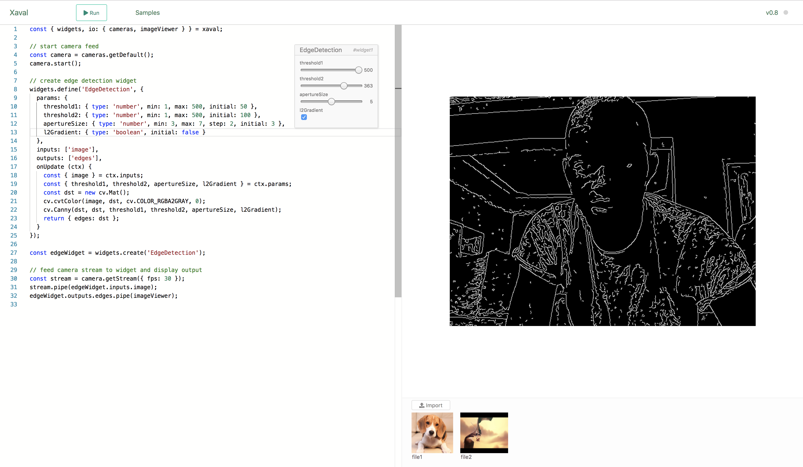

# Xaval

Xaval is a web-based playground for experimenting with image and computer vision. It is meant primarily for learning and exploration.

Xaval consists of a browser-based Javascript coding environment preloaded with the \[OpenCv.js\]\(\) library, an interactive widget engine and utilities for working with images and videos.


Xaval is is still in early development and has many limitations but keeps improving with each new version.


Here is an overview of the current features:

