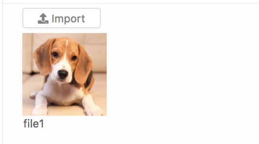
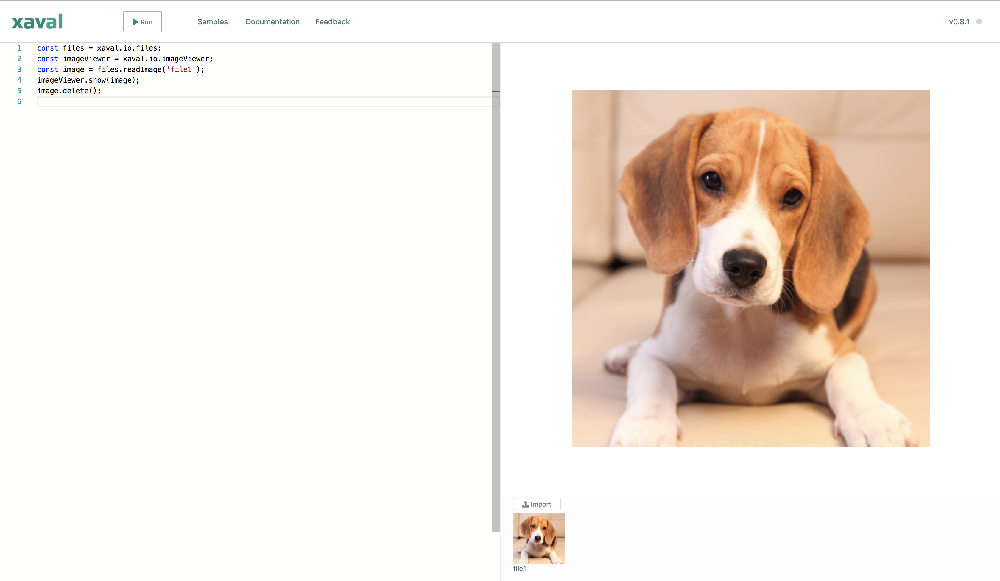
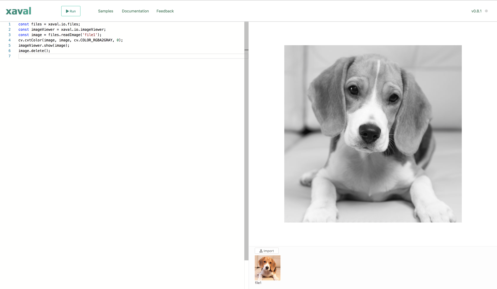

# Quick tour: grayscale conversion

In this section we are going to get a taste of using Xaval by writing a simple program to convert an image from color to grayscale.

## Importing the image

The first thing we want to do is import the image that were going to work with. To do this, click the **Import** button in the file library, then in the file browser dialog, select the image you want. Once imported into the file library, it will be given a name like _file1_. This is the name we are going to use to refer to the file. 

Your file library should now look something like this:




You can rename a file by clicking its name and changing it. Each file in the file library must have a unique name, you will get an error if you try to give a file a name that's already in use.


## Loading and displaying the image

Now we are finally going to write some code. Enter the following code in the editor:

```javascript
const files = xaval.io.files;
const imageViewer = xaval.io.imageViewer;
const image = files.readImage('file1');
imageViewer.show(image);
image.delete();
```

Now let's go throw what each statement does.

```javascript
const files = xaval.io.files;
```

Here were a creating a variable called `files` to reference the `xaval.io.files` object. `xaval.io.files` allows us to work with the file library programmatically. We are creating a variable for it simply to avoid having to type `xaval.io.files` all the time.

```javascript
const imageViewer = xaval.io.imageViewer;
```

Similarly we are creating a variable for `xaval.io.imageViewer`. The `xaval.io.imageViewer` allows us to programmatically display images on the image viewer.


Using object destructuring in modern Javascript, we can shorten the two lines as follows:

```javascript
const { files, imageViewer } = xaval.io;
```



Xaval exposes a global object called `xaval` which encapsulates all the built-in utilities and libraries provided by Xaval, including utilities used to interact with the Xaval environment itself. Think of it as the Xaval standard library.


```javascript
const image = files.readImage('file1');
```

This statement uses the `files.readImage()` method to read the image called `file1` from the file library and stored it in the `image` variable.

```javascript
imageViewer.show(image);
```

This displays the image we just loaded on the image viewer.

```javascript
image.delete();
```

Unfortunately we have to manually free the memory allocated for the image by calling the `delete()` method. `files.readImage()` returns an OpenCV.js matrix \(`cv.Mat`\) object, which is allocated memory on the [Emscripten](https://developer.mozilla.org/en-US/docs/Mozilla/Projects/Emscripten) heap, and which does not get deallocated automatically. Instead it exposes a `.delete()` method for freeing the memory.


If you don't free memory allocated by OpenCV.js objects on Emscripten heap, you program might end up reaching the maximum limit allowed by the browser and start getting errors. In such cases you can refresh the browser page to clean up and start again.


Now click the Run button to see the results. If everything worked correctly, your image should be displayed on the image viewer.




If you want to save or download the output image on the image viewer, right click it and select the option to save the image.


## Converting to grayscale

Now we get to do some simple image processing: converting our image to grayscale. This is where we summon the powers of OpenCV.

Before displaying the image, we are going to add the following code:

```javascript
cv.cvtColor(image, image, cv.COLOR_RGBA2GRAY, 0);
```

Now the entire code should look like this:

```javascript
const files = xaval.io.files;
const imageViewer = xaval.io.imageViewer;
const image = files.readImage('file1');
cv.cvtColor(image, image, cv.COLOR_RGBA2GRAY, 0);
imageViewer.show(image);
image.delete();
```

Xaval exposes the OpenCV.js library through a global object called `cv`. `cv.cvtColor()` is an OpenCV method for converting between different colorspaces. Here we are using it to convert from RGBA colorspace to grayscale \(specified by the code `cv.COLOR_RGBA2GRAY`\). The first argument is the image that we want to convert and the second is the destination memory where we want to store the converted image. In this case were are effectively replacing the colour image with the converted one. The last argument specifies the number of channels in the destination image. When set to 0, it will be derived automatically.


Modifications made to the image returned by `files.readImage()` do not affect the corresponding image in the library. Calling `files.readImage()` with the same filename twice will return a new image each time.


Now if you run your code, your image will be displayed in grayscale.



## Conclusion

In this section we have learned how to import images into the file library, how to load and display them and we have done a trivial form of image processing, converting to grayscale, using OpenCV. Hopefully this has given you an idea of what Xaval is about.

Other parts of the documentation will take you throw more detailed guides of more interesting features of Xaval including working with webcam and video, creating reactive widgets and more examples of image processing.

