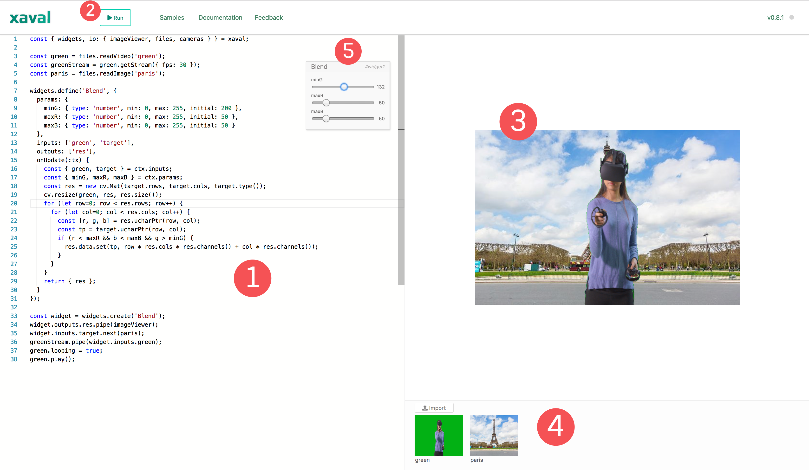

# Xaval interface

Before we proceed further, let's first familiarise ourselves with the main parts of the Xaval playground:

1. **Code editor**: This is where you write your Javascript code
2. **Run button**: Click this to run the code in your editor
3. **Image viewer**: This is used to display images
4. **File library**: This allows you to import files from your computer
5. **Reactive widget**: Widgets allow you to control function parameters in real time

